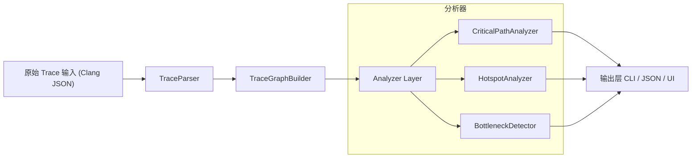

# 摘要

**BuildLens** 是一个针对 C/C++ 编译器的性能分析工具，其核心目标是将 Clang/GCC 编译过程生成的原始 trace 数据（Chrome Trace Event 格式）重建为“可理解的编译行为模型”，并提取关键路径、热点耗时和瓶颈信息。与现有的 Chrome Trace Viewer 不同，BuildLens 提供工程层面的分析洞察：它不仅展示时间线视图，还能自动识别“哪些文件/模板最耗时”、“哪些编译阶段位于关键路径”、“哪些编译单元耗时异常”等信息，从而帮助用户快速找到优化目标。  

**项目定位与目标用户：** 面向中大型 C/C++ 项目团队（尤其是使用 Clang/GCC 的开发者、构建工程师、性能优化工程师等），核心诉求是“编译时间可视化与分析”，用最少的学习成本解决编译慢的痛点。【4†L18-L24】【28†L46-L54】  

**核心价值主张：** BuildLens 将原本难以读懂的编译内部事件，抽象为可执行决策的信息。它的关键价值在于让“*工程师真正知道为什么编译变慢，从而知道如何优化*”，而不是仅给出一个黑箱报告。  

**成功指标（KPI）：** 可以量化的指标包括：分析准确度（关键路径识别正确率）、性能收益（优化后编译时间缩短百分比）、用户覆盖率（团队采用率）、以及分析时开销（分析运行时间占构建时间比例低于某值）。  

【23†L40-L49】【24†L228-L236】（参考 Rsdoctor、Bazel 文档等）指出，构建分析工具应提供**时序视图**（Timeline）、**构建行为分析**（如各加载器或阶段耗时）和**产物对比**等功能，BuildLens 目标是在类似层面提供对 Clang 编译的支持。

## 一、系统定位与总体架构

根据以上定位，**BuildLens** 的系统架构分为以下层级（图示）：



- **Trace Parser 层**：读取和解析 Clang `-ftime-trace` 生成的 JSON 文件，输出事件列表。主要任务是处理 JSON 格式（Chrome Trace Event 格式），抽取出各事件的`name`、`cat`、`ts`、`dur`、`pid`、`tid`等字段。  
- **Trace GraphBuilder 层**：将“扁平的事件列表”按照线程(`pid, tid`)和时间关系，构建成**编译调用图**。关键是对同一线程的事件按开始时间排序，采用栈算法将各个事件的嵌套关系还原为树或有向无环图结构。输出一个`CompileGraph`对象，包含根节点和子节点等关系。  
- **Analyzer 层**：基于调用图提取统计信息和洞察。包括：**关键路径分析（CriticalPathAnalyzer）**、**热点耗时分析（HotspotAnalyzer）**、**瓶颈检测（BottleneckDetector）**等模块。每个分析器接收 `CompileGraph` 或事件列表，计算对应结果（见下文详细设计）。  
- **输出层**：支持多种交互。包括**命令行界面（CLI）**输出结构化报告（JSON/表格），以及**用户界面**（Web/ECharts 或 Qt 桌面）可视化展示各分析结果。CLI 可嵌入 CI/CD；UI 提供交互式体验，如时序图、热点列表面板等。

## 二、系统分层职责与数据模型

下表列出各层级的主要职责与关键模块（类）示例：

| 层级            | 职责说明                                                                                                                      | 数据模型 / 核心类                             | 关键接口（示例）                                                                                 |
|---------------|-----------------------------------------------------------------------------------------------------------------------------|----------------------------------------------|------------------------------------------------------------------------------------------------|
| **输入/源**       | Clang/GCC 输出的原始 trace 文件（Chrome Trace JSON）。                                                                                   | Raw JSON trace (`traceEvents` 数组)           | N/A (文件输入)                                                                                   |
| **TraceParser** | 解析 JSON，将原始事件转换为统一的事件对象列表。                                                                                     | - `TraceEvent` 结构体 (字段：`name`, `cat`, `ts`, `dur`, `pid`, `tid`)<br>- `TraceParser` 类      | `List<TraceEvent> parseDirectory(path)`：递归读取文件夹中的所有 JSON，返回 `TraceEvent` 列表。                |
| **GraphBuilder** | 将按线程分组的事件流，按时间构建嵌套调用图 (`CompileGraph`)。                                                                     | - `TraceNode` 节点 (字段：`name`, `startTs`, `endTs`, `duration`, `children[]`)<br>- `CompileGraph`  | `CompileGraph buildGraph(List<TraceEvent> events)`：按照 (pid,tid) 组事件，返回根节点图结构。         |
| **Analyzer**    | 基于图结构计算各类指标：<br>- 关键路径: 找出最耗时路径。<br>- 热点: 聚合各类别/标签耗时排行。<br>- 瓶颈: 检测异常耗时节点。 | - `CriticalPathAnalyzer`, `HotspotAnalyzer`, `BottleneckDetector` | `Result analyze(CompileGraph graph)`：返回各分析结果结构（见 JSON Schema 设计）。                             |
| **输出/UI**      | 提供用户交互：<br>- CLI 输出（JSON/终端表格）。<br>- Web/ECharts 或 Qt 界面：时序图、列表、表格等。                                          | - `CLI` 类 / `GUI` 类<br>- 前端面板 (比如 `TimelinePanel`, `HotspotPanel`)    | `int main()`: 解析命令行参数，调用分析模块并输出。<br>`void updateUI(AnalysisResult res)`：将结果显示到界面组件。 |

**TraceEvent 数据结构示例（C++伪代码）：**

```cpp
struct TraceEvent {
    string name;
    string category;   // 事件类别，如 "parse","codegen"
    double ts;         // 开始时间 (微秒)
    double dur;        // 持续时间 (微秒)
    int pid, tid;      // 进程/线程 ID
};
```

- 该结构对应 Chrome Trace JSON 中的字段：`"name"`, `"cat"`, `"ts"`, `"dur"`, `"pid"`, `"tid"`【24†L238-L247】。一般只处理`ph="X"`(complete event)类型的数据。

## 三、TraceGraphBuilder 设计

**目标：** 从 TraceParser 输出的 `TraceEvent` 列表构建调用关系图，恢复事件的嵌套层次（大致的调用/并行结构）。

### 输入字段

- 输入：一组 `TraceEvent`，可能来自一个或多个 JSON 文件（Clang 为每个目标文件输出一个）。事件具有`(name, ts, dur, pid, tid)` 等字段，单位通常为微秒【24†L258-L266】。
- 可以假定：同一编译单元中 `pid` 相同；多线程编译时，每个 `tid` 表示一条编译线程。

### 归一化事件结构

我们首先将 `TraceEvent` 转为 **节点（TraceNode）**，增加计算字段：终止时间 `endTs = ts + dur`。数据结构示例如下：

```cpp
struct TraceNode {
    string name;
    double startTs;
    double endTs;
    double duration; 
    int threadId;
    vector<TraceNode*> children;
};
```

- 每个 `TraceNode` 表示一个事件，且其`children`存放紧邻其时间范围内发生的子事件（call stack 样式）。

### 栈算法构建调用图（伪码）

核心思想：对每个线程单独处理，按照开始时间对事件排序，利用栈结构恢复嵌套关系。示意伪码： 

```
function buildCallGraph(events: List<TraceEvent>) -> List<TraceNode>:
    // 按 (pid, tid) 分组
    graphs = []
    for each threadGroup in groupBy(events, key=(pid, tid)):
        sorted = sort(threadGroup by ts ascending)
        stack = empty stack<TraceNode>
        roots = []
        for ev in sorted:
            node = new TraceNode(ev.name, ev.ts, ev.ts+ev.dur, ev.dur, ev.tid)
            // 弹出已结束的事件
            while not stack.empty() and stack.top().endTs <= node.startTs:
                stack.pop()
            if stack.empty():
                // 没有父事件，node 为根
                roots.append(node)
            else:
                // 添加为栈顶的子事件
                stack.top().children.push_back(node)
            // 将 node 推入栈中
            stack.push(node)
        end for
        graphs.append(roots)
    end for
    return mergeGraphs(graphs) // 若多线程，可视情况合并或分别分析
```

- **时间复杂度**：主要开销为排序，每线程为 O(N log N)，总计 O(N log N)。构建过程本身 O(N)。若所有事件都按 `ts` 排序，则复杂度是 O(N log N)【15†L640-L649】。

- **空间复杂度**：存储所有节点 O(N)。

### 复杂度分析

| 步骤         | 时间复杂度      | 注释                   |
|------------|-------------|----------------------|
| JSON 解析     | O(N)        | 逐条读取事件              |
| 排序（各线程）  | O(N log N) | 并发或串行排序，可多线程加速   |
| 栈遍历构建图   | O(N)        | 每个事件最多入栈/出栈一次     |

总体以排序为主，即 O(N log N)。对于一个具有 `M` 条线程的构建，实际可以并行化对每条线程排序和构图。

### 示例：简化 trace 片段

假设输入 JSON 片段如下（Chrome Trace 格式）：

```json
{
  "traceEvents": [
    {"cat":"driver","name":"Compile","ph":"X","ts":0,"dur":100,"pid":1,"tid":1},
    {"cat":"parse"," name":"ParseAST","ph":"X","ts":0,"dur":40,"pid":1,"tid":1},
    {"cat":"parse"," name":"ParseDecl","ph":"X","ts":0,"dur":20,"pid":1,"tid":1},
    {"cat":"parse"," name":"ParseStmt","ph":"X","ts":20,"dur":20,"pid":1,"tid":1},
    {"cat":"codegen","name":"CodeGenFunction","ph":"X","ts":40,"dur":50,"pid":1,"tid":1},
    {"cat":"misc","name":"OtherWork","ph":"X","ts":90,"dur":10,"pid":1,"tid":1}
  ]
}
```

构建结果（缩略）：

```
Compile [0-100]
 ├─ ParseAST [0-40]
 │    ├─ ParseDecl [0-20]
 │    └─ ParseStmt [20-40]
 ├─ CodeGenFunction [40-90]
 └─ OtherWork [90-100]
```

从中可以提取**关键路径**（`Compile→ParseAST→ParseDecl`），**热点耗时**（如 `ParseAST`：40ms，总计占40% 等），以及检测到 `OtherWork` 耗时10ms是否异常等。

## 四、分析器模块设计

### 1. CriticalPathAnalyzer（关键路径分析）

**目标：** 找到整个编译过程中“最耗时的路径”——即从根节点开始，下钻到叶子的耗时最长链条。类似于项目管理中的关键路径识别。

**算法思路：** 在 `CompileGraph` 上进行一次深度优先遍历，计算每个节点到根的累计耗时（或其子树的最大耗时），选取路径最大的一条。伪码示例：

```
function computeCriticalPath(node: TraceNode) -> (path: List<string>, totalDur: double):
    if node.children.empty():
        return ([node.name], node.duration)
    maxPath = []
    maxDur = 0
    for child in node.children:
        (subPath, subDur) = computeCriticalPath(child)
        if subDur > maxDur:
            maxDur = subDur
            maxPath = subPath
    // 将当前节点前置到路径中
    return ([node.name] + maxPath, node.duration + maxDur)

root = the root TraceNode (e.g., Compile)
(criticalPathNames, criticalPathTime) = computeCriticalPath(root)
```

- 时间复杂度：O(N)，遍历每个节点一次。
- 输出格式（JSON Schema）示例如下：

| 字段            | 类型       | 说明                     |
|---------------|----------|------------------------|
| `criticalPath`| `Array`  | 关键路径事件列表，每项包含`name`和对应百分比或时间 |
| `name`        | `String` | 事件名称                 |
| `duration`    | `Number` | 该事件及其子路径总耗时   |
| `percentage`  | `Number` | 占总编译时间比例（可选） |

**示例输出：**

```json
{
  "criticalPath": [
    {"name": "Compile", "duration": 100, "percentage": 100},
    {"name": "ParseAST", "duration": 40,  "percentage": 40},
    {"name": "ParseDecl", "duration": 20, "percentage": 20}
  ]
}
```

### 2. HotspotAnalyzer（热点耗时聚合）

**目标：** 识别“最耗时的类型或任务”，例如哪类事件（Parsing、Instantiation、CodeGen 等）或哪几个文件/函数累计耗时最多。

**算法思路：** 对所有事件按照某个维度进行汇总统计。如按 `event.name` 或 `category`（`cat` 字段）来聚合总耗时，选取耗时最高的前 N 项。伪码示例：

```
function computeHotspots(events: List<TraceEvent>) -> List<(name, totalDur)>:
    map<string,double> sumDur;
    for ev in events:
        sumDur[ev.name] += ev.dur
    // 找出耗时最多的前N项
    return topN(sumDur, N=10)
```

- 可以支持多种聚合方式：  
  - 按事件名称（函数/阶段）  
  - 按文件名（如果事件包含文件信息，可提前解析）  
  - 按线程或编译阶段（category）  

- 时间复杂度：O(N + M log M)（N为事件数，M为独特键数）。一般锁瓶为遍历 O(N)。  

- 输出格式（JSON Schema）示例：

| 字段       | 类型     | 说明                   |
|----------|--------|----------------------|
| `hotspots` | `Array` | 热点列表               |
| `name`   | `String` | 聚合项名称（函数、文件或阶段） |
| `totalDuration` | `Number` | 累计耗时             |
| `count`  | `Integer` | 事件次数（可选）        |

**示例输出：**

```json
{
  "hotspots": [
    {"name": "ParseAST", "totalDuration": 40, "count": 2},
    {"name": "CodeGenFunction", "totalDuration": 50, "count": 1}
  ]
}
```

### 3. BottleneckDetector（瓶颈检测）

**目标：** 检测哪些编译单元（例如源文件或阶段）耗时“异常”地高，可视为优化重点。

**算法思路：** 可以简单地统计所有文件或事件的耗时，计算均值和标准差，找出超出阈值（例如高于均值+2σ）的项。伪码示例：

```
function detectBottlenecks(durations: List<double>) -> List<Bottleneck>:
    mean = average(durations)
    std = standardDeviation(durations)
    threshold = mean + 2*std
    for each item in durations:
        if item.value > threshold:
            add to results
    return results
```

- 输出格式（JSON Schema）示例：

| 字段          | 类型     | 说明                    |
|-------------|--------|-----------------------|
| `bottlenecks` | `Array` | 瓶颈列表                |
| `name`      | `String` | 瓶颈项名称（文件/阶段）      |
| `duration`  | `Number` | 耗时                    |
| `score`     | `Number` | 分数（如 `(dur-mean)/std`） |

**示例输出：**

```json
{
  "bottlenecks": [
    {"name": "big_header.hpp", "duration": 500, "score": 4.5}
  ]
}
```

### 算法复杂度与风险

- 以上分析器算法均为遍历型计算，主要复杂度 O(N)~O(N log N)，其中 N 为节点/事件数。  
- 实现风险：**中等**。关键在于正确处理嵌套关系（Critical Path）和聚合策略（Hotspot）。需要注意内存占用（N 大时）及准确性校验。参考 Chrome Trace 的实现思路【24†L238-L247】可降低误差。

## 五、CLI 与 UI 交互设计

### CLI 接口

- **命令行工具：** `buildlens`（或 `buildlens analyze`）。示例：  
  ```
  buildlens analyze --input trace.json --output report.json
  ```
- **主要参数：**  
  - `--input <path>`：输入 JSON 路径（文件或目录）。  
  - `--output <file>`：输出分析结果（JSON 格式）。  
  - `--format <type>`：输出格式（json 或 csv）。  
  - `--threshold <N>`：指定瓶颈检测阈值（如均值+Nσ）。  
  - `--help`：显示帮助信息。  

- **输出契约：** 以 JSON 报表为主，包含各分析器结果，示例如下（简化）：

```json
{
  "criticalPath": [ ... ],
  "hotspots": [ ... ],
  "bottlenecks": [ ... ]
}
```

- 该 JSON 可供 CI 系统或脚本解析，或被本地 UI 加载。

### UI 设计（可选技术：Web/ECharts 或 Qt）

- **总体布局：** 拆分为几个面板（tabs 或窗格）。例如：  
  1. **时间线视图（Timeline Panel）：** 类似 Chrome tracing 界面，显示各线程和阶段的条状图。  
  2. **关键路径面板：** 列出关键路径上的事件，配以树形展示和百分比。  
  3. **热点面板：** 以表格或条形图形式列出 Top-N 热点。  
  4. **瓶颈面板：** 列出检测到的异常项，附带分数或可视警告。  

- **交互契约：** CLI 输出 JSON 格式文件，由 UI 加载解析；或 CLI 启动本地 HTTP 服务，前端通过 REST API 请求数据。  
  - 示例：`buildlens --serve --input trace.json` 在本地启动服务器，前端网页通过 `GET /api/report` 获取 JSON；UI 根据此 JSON 渲染面板。  
  - 或者：UI 直接读取 CLI 生成的 JSON 文件。

- **面板草图说明：**   
  - 时间线面板上方为线程分隔带，各个事件用不同颜色标识（例如 Parse, Inst, CodeGen）。  
  - 关键路径面板列出路径列表，并可展开查看子事件时间（类似树形表格）。  
  - 热点面板为排序表格或柱状图（x 轴为耗时，y 轴为事件名）。  
  - 瓶颈面板以列表形式显示异常项及建议说明（可标红提示）。

（注：因为篇幅所限，具体 UI 草图未绘制，此处仅描述交互要素。）

## 六、v0.2 最小可交付物（MVP）与14天计划

**v0.2 MVP 功能清单：**  
- TraceParser 能够读取 Clang JSON，输出事件列表（已完成）。  
- TraceGraphBuilder 实现调用图构建。  
- CriticalPathAnalyzer、HotspotAnalyzer、BottleneckDetector 功能实现，输出 JSON 报表。  
- CLI 接口：完成命令行参数解析、调用分析模块并生成 JSON 输出。  
- 简单 UI：使用 Web/ECharts，支持加载 CLI 输出的 JSON，显示上述分析结果（时间线/列表）。

### 14天开发计划（示例）

| 天数 | 任务                     | 验收标准                                   | 估算人日 | 风险等级 |
|-----|------------------------|-----------------------------------------|-------|------|
| D1  | 设计 TraceGraphBuilder 类结构   | 绘制类图，定义数据结构；代码评审通过                   | 0.5   | 低   |
| D2  | 实现事件归一化（TraceParser输出） | 编写并测试 `TraceGraphBuilder.buildGraph`，通过单元测试        | 1.0   | 低   |
| D3  | 实现调用图构建算法          | 对示例 Trace 构建正确的树结构，输出验证示例               | 1.0   | 低   |
| D4  | 设计 CriticalPathAnalyzer  | 定义输出数据结构；绘制 JSON Schema 表                     | 0.5   | 低   |
| D5  | 实现 CriticalPathAnalyzer   | 单元测试通过，结果正确；根据样例数据生成正确路径             | 1.0   | 中   |
| D6  | 设计 HotspotAnalyzer      | 定义聚合策略；绘制 JSON Schema 表                         | 0.5   | 低   |
| D7  | 实现 HotspotAnalyzer      | 验证前几名热点正确，支持不同聚合维度；完成单元测试            | 1.0   | 中   |
| D8  | 设计 BottleneckDetector   | 确定统计方法（均值+2σ）；绘制 JSON Schema                   | 0.5   | 低   |
| D9  | 实现 BottleneckDetector   | 正确标出超阈值项；单元测试验证                              | 1.0   | 中   |
| D10 | 集成分析模块与CLI        | 实现 `main()` 调用链，生成综合报告；完成功能测试             | 1.0   | 中   |
| D11 | UI 页面原型搭建         | 使用 ECharts 绘制基本时间线和表格；能够加载 JSON 显示数据       | 1.5   | 高   |
| D12 | UI 关键路径/热点面板      | 实现关键路径和热点表格视图；进行手动测试                    | 1.5   | 高   |
| D13 | UI 调试与性能优化        | 解决界面卡顿问题；完善交互；兼容性测试                     | 1.0   | 中   |
| D14 | 文档与验收             | 编写用户手册、安装说明，验收所有功能（单元测试、集成测试）    | 1.0   | 低   |

- **验收标准：** 所有模块单元测试通过；CLI 生成报告与预期格式一致；UI 可视化正确展示示例数据；整体性能可接受（分析时间远小于编译时间）。  
- **估算说明：** 上表中的人日仅为开发时间粗略估算，不包括假期。风险等级反映技术难度（如 UI 前端需熟悉 ECharts 或 Qt，风险较高【28†L46-L54】）。

## 七、后续演进路线 (v0.3 – v1.0)

| 版本  | 功能增量                                     | 商业化假设与目标                                               |
|-----|------------------------------------------|-----------------------------------------------------------|
| **v0.3** | - 多会话对比：支持比较不同构建产生的报告（性能回归检测）。<br>- 多文件拖放输入（UI 改进）。 | 假设：初始用户群体开始尝试本地工具，希望验证各次提交的性能波动。 |
| **v0.4** | - CI/CD 集成：提供 GitHub Action 或 CLI 可嵌入自动化流程。<br>- 历史趋势跟踪：保存多次分析记录。 | 假设：团队愿意为持续集成环境购买插件/服务，提升长期效益。               |
| **v1.0** | - 企业版仪表盘：Web Dashboard，团队协作，多项目对比。<br>- 高级洞察：AI 优化建议，警告订阅。 | 假设：大团队客户付费意愿强，追求编译效率，一次性或订阅付费。             |

- **商业化假设：** 根据工具发展经验，桌面免费版负责吸引用户，【23†L77-L79】；真正付费市场在持续集成和团队协作场景（企业愿意为节省大量开发时间付费）。  
- 各阶段重点：v0.3-0.4 通过验证用户需求与反馈（如调查 C++ 社区）逐步推进产品化；v1.0 结合企业服务和可能的插件生态实现变现。

## 八、风险与缓解措施

| 类型   | 风险描述                           | 缓解措施                                       |
|------|--------------------------------|-------------------------------------------|
| 技术   | - 解析大型 trace 性能瓶颈（内存/时间）。<br>- Qt 桌面端依赖，商业授权限制。 | - 对数据量做局部加载，仅处理必要字段；<br> - 优先 Web 前端（ECharts），避免 Qt 授权问题。 |
| 法律   | - GPL/Qt 授权：若闭源分发需购买许可。       | - 采用 LGPL/免费工具链（例如 ECharts/Web）。<br>- 选择 MIT 或 Apache 2.0 开源许可，避免 GPLv3 限制。 |
| 市场   | - C++ 社区接受度：工具市场成熟、保守。<br>- 竞争对手（VS Build Insights）。 | - 先发布开源版本积累口碑【23†L77-L79】；<br>- 专注 Clang/Linux 环境，避开 VS 专属市场【24†L197-L201】；<br>- 与编译器和 CI 紧密集成建立差异化。 |
| 依赖   | - Clang 更新：事件格式或性能开关变化。      | - 定期跟踪 LLVM/Clang 版本，更新解析适配。               |
| 用户体验 | - UI 可用性：复杂数据可视化难实现友好。   | - 初期简化界面，重点展示最关键数据；<br>- 收集用户反馈逐步改进。  |

## 九、许可证推荐

推荐采用 **MIT 或 Apache 2.0** 开源协议（**MIT 更为轻量**），原因如下：  
- 这些许可证宽松、无商业限制，有利于开发者推广和采用【23†L77-L79】。  
- 参考同类工具（如 Rsdoctor）使用 MIT【28†L77-L79】，可降低法律摩擦。  
- LGPL/GPLv3 虽可免费使用，但会迫使客户开源、并存在授权复杂度（Qt 商业版成本高）。  

## 十、参考文献

- Clang 文档：`-ftime-trace` 选项及 Chrome Tracing 输出【4†L18-L24】  
- Bazel 构建性能分析（Chrome Trace JSON 示例）【24†L238-L247】【24†L197-L201】  
- Rsdoctor 构建分析工具特性【28†L46-L54】【28†L77-L79】  
- (以上引用源自官方文档和业界实践，用于支撑设计决策和格式规范)

